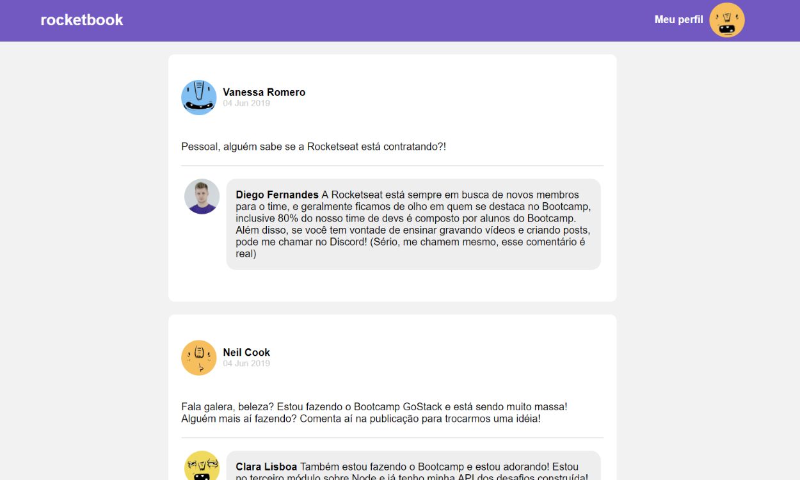

# Rocketseat :rocket: GoStack <a href="https://github.com/Rocketseat/bootcamp-gostack-desafio-04">Challenge 04</a>



---

This a static page made with ReactJS to learn some concepts about it.

The concepts I learned:

- Components
- Props
- States
- JSX
- Components lifecycle
- Immutability

I also had contact with some important technologies to make React apps possible, like Babel and Webpack. That way I could kinda understand how it works.

## Run this project

First, install the dependencies

_Using Yarn_

```bash
yarn
```

_Using Npm_

```bash
npm install
```

Then run it!

```bash
yarn dev
```

or

```bash
npm run dev
```
